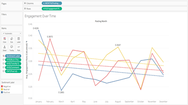
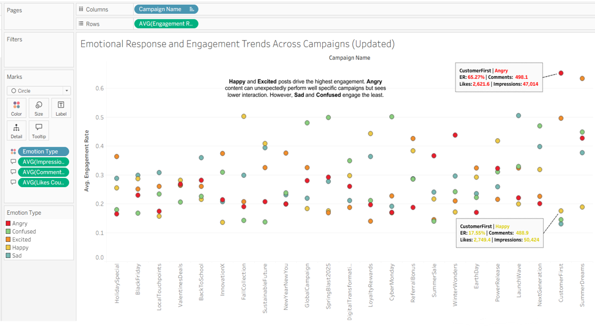
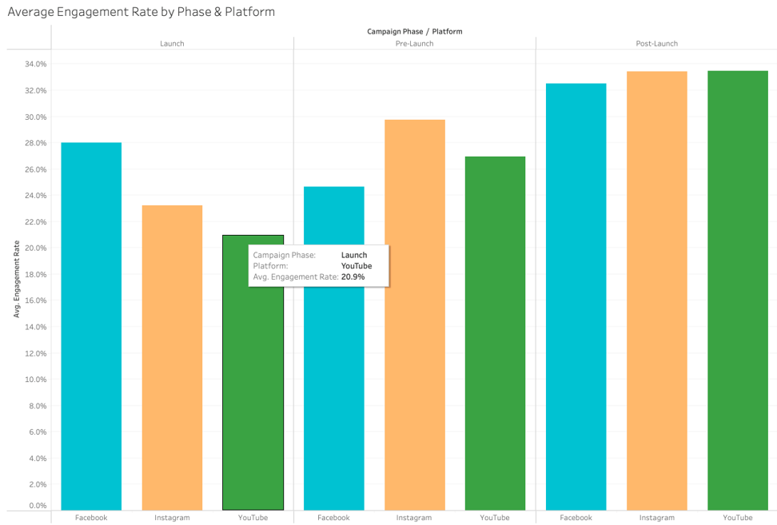
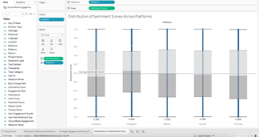
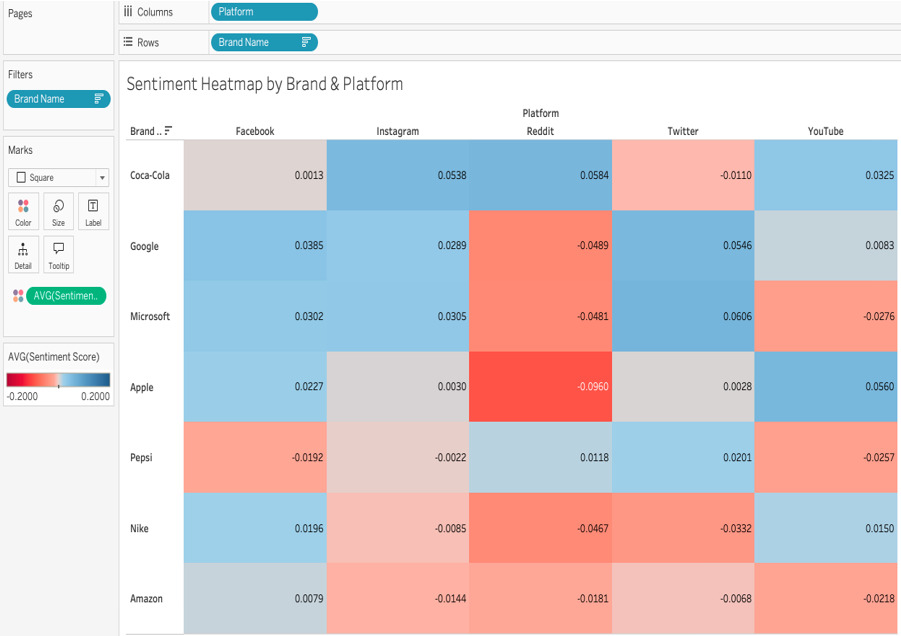
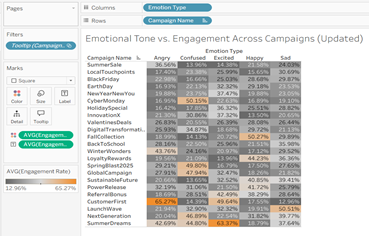
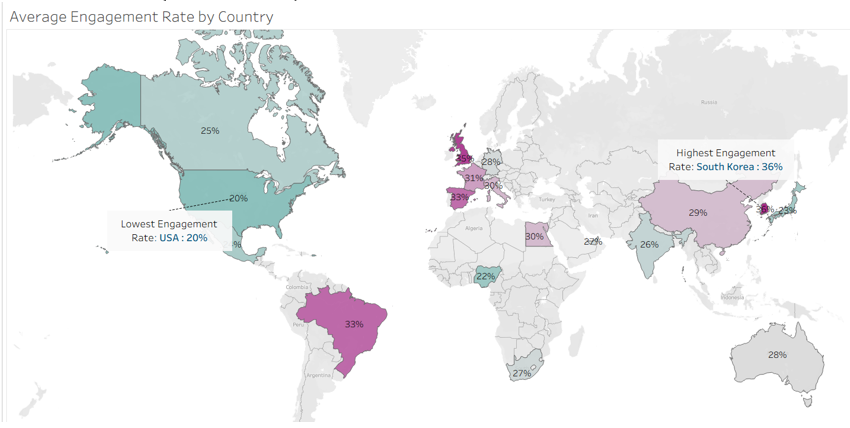

# 📊 Social Media Engagement Analysis & Visualization
### What Drives Engagement? A Visual Dive into Sentiment, Time & Platform Strategy

  
  
  
  
  

<i>A Tableau-powered data visualization project exploring how timing, emotion, sentiment, and geography drive social media engagement across platforms and campaigns.</i>

<!-- REPLACE with your dashboard screenshot -->
<!--  -->

---

## Project Overview

With millions of posts competing for attention across social media platforms, understanding what makes content go viral has become both an art and a science. This project takes a **data-driven approach** to uncovering the variables behind successful social media content.

Using a rich dataset of social media post metrics, we analyzed how **timing**, **content category**, **sentiment**, and **emotional tone** contribute to high engagement. The goal is to provide actionable insights for content strategists and marketers — helping them optimize their publishing calendars, craft more engaging narratives, and strategically leverage emotions for maximum reach.

**Primary tool:** Tableau — for interactive dashboards, calculated fields, and storytelling.
**AI assistance:** OpenAI and GenAI were used to support initial visualization design, research question development, and report writing.
**Peer feedback:** Tableau Community Slack was used to iterate on visual encodings, layout decisions, and color schemes.

---

## Research Questions

| # | Research Question | Chart Type |
|---|-------------------|------------|
| **RQ1** | How does average engagement rate vary across content categories and weekdays? | Heatmap |
| **RQ2** | How does engagement change over time by sentiment? | Time Series Line Chart |
| **RQ3** | At what time of day are users most engaged? | Horizontal Stacked Bar Chart |
| **RQ4** | Do certain emotions lead to higher virality on social media? | Dot Plot |
| **RQ5** | How does engagement performance differ across campaign phases (Pre-Launch, Launch, Post-Launch)? | Grouped Bar Chart |
| **RQ6** | How do sentiment levels vary across different product brands and social media platforms? | Box-and-Whisker Plot + Heatmap |
| **RQ7** | Do emotions impact engagement rates across different campaigns? | Heatmap + Dot Plot |
| **RQ8** | Do engagement rates vary significantly across countries? | Choropleth Map |

---

## Dataset

- **Source:** [Social Media Engagement Dataset — Kaggle](https://www.kaggle.com/datasets/subashmaster0411/social-media-engagement-dataset) by SubashMaster0411
- **File:** `Social Media Engagement Dataset.xlsx`
- **Scale:** Thousands of social media post records across multiple platforms and campaigns

**Key fields in the dataset:**

| Field | Description |
|-------|-------------|
| `Post ID` | Unique identifier for each post |
| `Timestamp` | Date and time the post was published |
| `Platform` | Facebook, Instagram, Twitter, Reddit, YouTube |
| `Topic Category` | Delivery, Marketing, Pricing, Product, Returns, Support |
| `Campaign Name` | Associated marketing campaign |
| `Campaign Phase` | Pre-Launch, Launch, Post-Launch |
| `Brand Name` | Product brand associated with the post |
| `Likes Count` | Number of likes |
| `Comments Count` | Number of comments |
| `Shares Count` | Number of shares |
| `Impressions` | Total post impressions |
| `Sentiment Label` | Negative, Neutral, Positive |
| `Sentiment Score` | Numeric sentiment value (−1 to +1) |
| `Emotion Type` | Angry, Confused, Excited, Happy, Sad |
| `Location` | City, Country format (e.g., "Houston, USA") |
| `Toxicity Score` | Toxicity level of the post content |
| `Buzz Change Rate` | Rate of engagement growth/change |

---

## Calculated Fields

All calculated fields were created in Tableau:

| Field | Formula |
|-------|---------|
| `Engagement Rate (Calculated)` | `(Likes Count + Comments Count + Shares Count) / Impressions` |
| `Total Engagement` | `Likes Count + Comments Count + Shares Count` |
| `Posting Weekday` | `DATENAME('weekday', [Timestamp])` |
| `Posting Month` | `DATETRUNC('month', [Timestamp])` |
| `Posting Hour (24h)` | `DATEPART('hour', [Timestamp])` |
| `Time of Day` | Morning (5–12h) / Afternoon (12–17h) / Evening (17–21h) / Night |
| `Country` | `SPLIT(Location, ", ", 2)` |
| `Dominant Emotion` | Custom logic based on highest-frequency emotion per country |

---

## 📈 Visualizations & Insights

### RQ1 — Heatmap: Engagement by Content Category & Weekday

  
   <em>Figure 1 — Post Type vs. Weekday Engagement Heatmap</em>

| | Detail |
|-|--------|
| **Fields** | Topic Category (Rows), Posting Weekday (Columns), AVG(Engagement Rate) — Color & Label |
| **Enhancement** | Diverging color palette centered around average engagement rate |
| **Insight** | `Product` posts peak mid-week (Tuesday); `Delivery` performs best on weekends (Sunday). Helps marketers optimize their publishing calendar. |

---

### RQ2 — Time Series: Engagement Over Time by Sentiment

  
   <em>Figure 2 — Engagement Over Time by Sentiment</em>

| | Detail |
|-|--------|
| **Fields** | Sentiment Label (Rows), Posting Month (Columns), Sentiment Label — Color |
| **Enhancement** | Trend lines per sentiment category; marked min/max values; adjusted axis scaling |
| **Insight** | Positive sentiment shows strong sustained engagement. High negative sentiment months also spike sharply — emotionally charged content triggers short-term engagement bursts. |

---

### RQ3 — Horizontal Bar Chart: Time of Day Performance

  
   <em>Figure 3 — Time of Day Performance by Platform</em>

| | Detail |
|-|--------|
| **Fields** | Time of Day (Rows), AVG(Engagement Rate) (Columns), Platform — Color |
| **Enhancement** | Replaced raw hour (24h) with grouped Time of Day buckets; Platform filter added |
| **Insight** | Facebook & Instagram peak in **late evenings (6–9 PM)**. Twitter maintains consistent engagement throughout the day. |

---

### RQ4 — Dot Plot: Emotion vs. Engagement Across Campaigns

  
   <em>Figure 4 — Emotional Response and Engagement Trends Across Campaigns</em>

| | Detail |
|-|--------|
| **Fields** | Campaign Name (Columns), AVG(Engagement Rate) (Rows), Emotion Type — Color |
| **Enhancement** | Viz-in-Tooltip for highlighted points; label callouts for outliers; custom emotion sorting |
| **Insight** | `Happy` and `Excited` emotions drive highest engagement (e.g., NextGenReveal, SummerDreams). `Angry` consistently reduces engagement. |

---

### RQ5 — Grouped Bar Chart: Engagement by Campaign Phase & Platform

  
   <em>Figure 5 — Average Engagement Rate by Campaign Phase and Platform</em>

| | Detail |
|-|--------|
| **Fields** | Campaign Phase → Platform (Columns), AVG(Engagement Rate) (Rows) |
| **Enhancement** | Converted stacked bars to grouped/clustered; platform-specific color scheme; percentage formatting |
| **Insight** | Engagement is highest during **Launch and Post-Launch** phases on Facebook & Instagram. Twitter peaks at Launch but drops post-launch. |

---

### RQ6 — Box-and-Whisker Plot + Heatmap: Sentiment by Brand & Platform

  
   <em>Figure 6 — Distribution of Sentiment Scores Across Platforms</em>

  
   <em>Figure 7 — Sentiment Heatmap by Brand and Platform</em>

| | Detail |
|-|--------|
| **Box Plot Fields** | Platform (Columns), Sentiment Score (Rows), Box-and-Whisker via Analytics pane |
| **Heatmap Fields** | Platform (Columns), Brand Name (Rows), AVG(Sentiment Score) — Color & Label |
| **Enhancement** | Diverging red–blue palette; overall mean reference line; synced axis (−1 to +1) |
| **Insight** | Twitter and Reddit have the **widest sentiment spread** and most negative outliers. Google and Microsoft are consistently positive; Pepsi and Nike trend negative on Reddit/Twitter. |

---

### RQ7 — Heatmap: Emotion vs. Engagement by Campaign

  
   <em>Figure 8 — Emotional Tone vs. Engagement Across Campaigns</em>

| | Detail |
|-|--------|
| **Fields** | Emotion Type (Columns), Campaign Name (Rows), AVG(Engagement Rate) — Color & Label |
| **Enhancement** | Diverging orange/gray palette; % labels inside cells; campaign/emotion sorting; phase filter |
| **Insight** | `Happy` and `Excited` drive higher engagement in campaigns like BackToSchoolBlitz and NewProductReveal. `Sad` and `Angry` consistently underperform. |

---

### RQ8 — Choropleth Map: Engagement by Country

  
   <em>Figure 9 — Average Engagement Rate by Country</em>

| | Detail |
|-|--------|
| **Fields** | Longitude (Columns), Latitude (Rows), AVG(Engagement Rate) — Color gradient |
| **Enhancement** | Filled map style; parsed country from location field; min/max country labels |
| **Insight** | **South Korea** has the highest engagement rate (36%); **USA** has the lowest (20%). Country-level strategies are essential for localization and timing. |

---

## Dashboard Storytelling

The final Tableau story is organized into **4 dashboards**:

| Dashboard | Focus | Key Charts |
|-----------|-------|------------|
| **When and What to Post** | Optimal posting schedule | Weekday Heatmap + Time of Day Bar Chart |
| **Sentiment Over Time & Phase** | Sentiment trends and campaign timing | Time Series + Grouped Bar Chart |
| **Emotion and Virality** | Emotional impact on engagement | Dot Plot + Emotion Heatmap |
| **Brand and Regional Strategy** | Brand sentiment and geographic engagement | Sentiment Heatmap + Choropleth Map |

> 🔗 **[View the full interactive dashboard on Tableau Public](https://public.tableau.com/app/profile/roza.naser.khan.chowdhury/viz/WhatDrivesEngagementAVisualDiveintoSentimentTimePlatformStrategy/Storytelling)**

---

## Key Findings

- **Timing matters** — Product posts peak mid-week; Delivery posts perform best on Sunday evenings (6–9 PM)
- **Emotion is the strongest engagement driver** — `Happy` and `Excited` consistently outperform `Sad` and `Angry` across campaigns
- **Platform behavior differs** — Facebook & Instagram peak in the evening; Twitter is steady throughout the day
- **Campaign phase impacts engagement** — Launch and Post-Launch phases generate the most interaction on Facebook & Instagram
- **Geography is significant** — South Korea, Canada, and the UK lead in engagement; Brazil and USA trail behind
- **Sentiment volatility** — Twitter and Reddit show the widest sentiment spread and most negative outliers
---

## Tools & Technologies

| Tool | Purpose |
|------|---------|
| [Tableau Desktop / Public](https://public.tableau.com) | Dashboard creation and storytelling |
| [Microsoft Excel](https://www.microsoft.com/excel) | Data cleaning and preparation |
| [Kaggle Dataset](https://www.kaggle.com/datasets/subashmaster0411/social-media-engagement-dataset) | Source data |
| [OpenAI ChatGPT](https://openai.com) | Visualization ideation and report assistance |
| [Tableau Community Slack](https://tableau-datafam.slack.com) | Peer feedback on visualizations |

---

  DSCI 5360 — Data Visualization | University of North Texas

