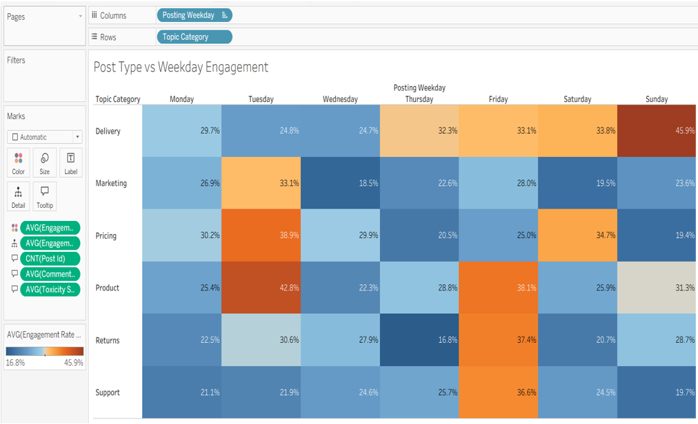
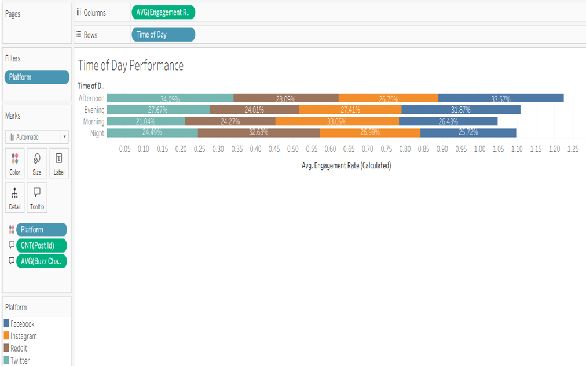

# Social Media Engagement Analysis & Visualization
## Final Project Report

> **Course:** DSCI 5360 Section 005 — Data Visualization
> **Institution:** University of North Texas

---

## Table of Contents

- [Introduction & Background](#-introduction--background)
- [Dataset Overview & Preparation](#-dataset-overview--preparation)
- [Research Questions](#-research-questions)
- [Visualizations & Insights](#-visualizations--insights)
- [Dashboard Storytelling](#-dashboard-storytelling)
- [Key Findings](#-key-findings)
- [Use of AI](#-use-of-ai)
- [Challenges Faced](#-challenges-faced)
- [Conclusion](#-conclusion)
- [References](#-references)

---

## Introduction & Background

As organizations increasingly rely on data analytics to enhance their engagement strategies, social media has become a major catalyst in marketing and audience interactions. With millions of posts competing for attention across platforms, understanding how content goes viral has become both an art and a science.

This project takes a data-driven approach to uncovering the variables behind successful social media content — including **timing**, **content category**, **sentiment**, and **emotional tone**. The overarching goal is to provide actionable insights for content strategists and marketers to optimize their publishing calendars and leverage emotions for viral consumption.

**Primary tool:** Tableau — for dashboard creation, calculated fields, and storytelling.
**AI assistance:** OpenAI and GenAI were used for initial visualization design, research question development, and report writing.
**Peer feedback:** Tableau Community Slack was used to iterate on visual encodings, layouts, and color schemes.

---

## Dataset Overview & Preparation

**Source:** Social Media Engagement Dataset by SubashMaster0411 ([Kaggle, 2024](https://www.kaggle.com/datasets/subashmaster0411/social-media-engagement-dataset))

The dataset contains thousands of records of social media posts with key performance indicators (KPIs) offering critical insights about audience engagement and content performance.

**Key transformations applied:**

| Transformation | Description |
|---------------|-------------|
| `Posting Hour` | Extracted from Timestamp using `DATEPART` |
| `Time of Day` | Grouped hours into Morning / Afternoon / Evening / Night |
| `Posting Weekday` | Extracted using `DATENAME('weekday', [Timestamp])` |
| `Engagement Rate` | `(Likes + Comments + Shares) / Impressions` |
| `Total Engagement` | Sum of Likes, Comments, and Shares |
| `Country` | Parsed from Location field using `SPLIT(Location, ", ", 2)` |
| `Dominant Emotion` | Custom calculated field per country |
| `Sentiment Standardization` | Cleaned and normalized sentiment values across platforms |

Visualizations from separate Tableau workbooks were merged into one integrated Tableau file for cohesive dashboard storytelling.

---

## Research Questions

| # | Research Question |
|---|-------------------|
| **RQ1** | How does the average engagement rate vary across content categories and weekdays? |
| **RQ2** | How does engagement change over time by sentiment? |
| **RQ3** | At what time of day are users most engaged? |
| **RQ4** | Do certain emotions lead to higher virality on social media? |
| **RQ5** | How does engagement performance differ across campaign phases (Pre-Launch, Launch, Post-Launch)? |
| **RQ6** | How do sentiment levels vary across different product brands and social media platforms? |
| **RQ7** | Do emotions impact engagement rates across different campaigns? |
| **RQ8** | Do engagement rates vary significantly across countries? |

---

## 📈 Visualizations & Insights

### RQ1 — Heatmap: Engagement by Content Category & Weekday

  
   <em>Figure 1 — Post Type vs. Weekday Engagement Heatmap</em>

| | Detail |
|-|--------|
| **Fields** | Topic Category (Rows), Posting Weekday (Columns), AVG(Engagement Rate) — Color & Label |
| **Enhancement** | Diverging color palette centered around average engagement rate |
| **Insight** | `Product` posts peak mid-week (Tuesday); `Delivery` performs best on weekends (Sunday). Helps marketers optimize their publishing calendar. |

---

### RQ2 — Time Series: Engagement Over Time by Sentiment

  
   <em>Figure 2 — Engagement Over Time by Sentiment</em>

| | Detail |
|-|--------|
| **Fields** | Sentiment Label (Rows), Posting Month (Columns), Sentiment Label — Color |
| **Enhancement** | Trend lines per sentiment category; marked min/max values; adjusted axis scaling |
| **Insight** | Positive sentiment shows strong sustained engagement. High negative sentiment months also spike sharply — emotionally charged content triggers short-term engagement bursts. |

---

### RQ3 — Horizontal Bar Chart: Time of Day Performance

  
   <em>Figure 3 — Time of Day Performance by Platform</em>

| | Detail |
|-|--------|
| **Fields** | Time of Day (Rows), AVG(Engagement Rate) (Columns), Platform — Color |
| **Enhancement** | Replaced raw hour (24h) with grouped Time of Day buckets; Platform filter added |
| **Insight** | Facebook & Instagram peak in **late evenings (6–9 PM)**. Twitter maintains consistent engagement throughout the day. |

---

### RQ4 — Dot Plot: Emotion vs. Engagement Across Campaigns

  
   <em>Figure 4 — Emotional Response and Engagement Trends Across Campaigns</em>

| | Detail |
|-|--------|
| **Fields** | Campaign Name (Columns), AVG(Engagement Rate) (Rows), Emotion Type — Color |
| **Enhancement** | Viz-in-Tooltip for highlighted points; label callouts for outliers; custom emotion sorting |
| **Insight** | `Happy` and `Excited` emotions drive highest engagement (e.g., NextGenReveal, SummerDreams). `Angry` consistently reduces engagement. |

---

### RQ5 — Grouped Bar Chart: Engagement by Campaign Phase & Platform

  
   <em>Figure 5 — Average Engagement Rate by Campaign Phase and Platform</em>

| | Detail |
|-|--------|
| **Fields** | Campaign Phase → Platform (Columns), AVG(Engagement Rate) (Rows) |
| **Enhancement** | Converted stacked bars to grouped/clustered; platform-specific color scheme; percentage formatting |
| **Insight** | Engagement is highest during **Launch and Post-Launch** phases on Facebook & Instagram. Twitter peaks at Launch but drops post-launch. |

---

### RQ6 — Box-and-Whisker Plot + Heatmap: Sentiment by Brand & Platform

  
   <em>Figure 6 — Distribution of Sentiment Scores Across Platforms</em>

  
   <em>Figure 7 — Sentiment Heatmap by Brand and Platform</em>

| | Detail |
|-|--------|
| **Box Plot Fields** | Platform (Columns), Sentiment Score (Rows), Box-and-Whisker via Analytics pane |
| **Heatmap Fields** | Platform (Columns), Brand Name (Rows), AVG(Sentiment Score) — Color & Label |
| **Enhancement** | Diverging red–blue palette; overall mean reference line; synced axis (−1 to +1) |
| **Insight** | Twitter and Reddit have the **widest sentiment spread** and most negative outliers. Google and Microsoft are consistently positive; Pepsi and Nike trend negative on Reddit/Twitter. |

---

### RQ7 — Heatmap: Emotion vs. Engagement by Campaign

  
   <em>Figure 8 — Emotional Tone vs. Engagement Across Campaigns</em>

| | Detail |
|-|--------|
| **Fields** | Emotion Type (Columns), Campaign Name (Rows), AVG(Engagement Rate) — Color & Label |
| **Enhancement** | Diverging orange/gray palette; % labels inside cells; campaign/emotion sorting; phase filter |
| **Insight** | `Happy` and `Excited` drive higher engagement in campaigns like BackToSchoolBlitz and NewProductReveal. `Sad` and `Angry` consistently underperform. |

---

### RQ8 — Choropleth Map: Engagement by Country

  
   <em>Figure 9 — Average Engagement Rate by Country</em>

| | Detail |
|-|--------|
| **Fields** | Longitude (Columns), Latitude (Rows), AVG(Engagement Rate) — Color gradient |
| **Enhancement** | Filled map style; parsed country from location field; min/max country labels |
| **Insight** | **South Korea** has the highest engagement rate (36%); **USA** has the lowest (20%). Country-level strategies are essential for localization and timing. |

---

## Dashboard Storytelling

The final Tableau story is organized into 4 dashboards, each representing a strategic angle:

### Dashboard 1 — When and What to Post

Enhanced with floating filters for average engagement rate and platform comparison.

**Takeaways:**
- Shows optimal posting days and content types
- Helps schedule a data-driven content calendar
- Reveals peak user engagement hours per platform

---

### Dashboard 2 — Sentiment Over Time & Phase

Filtered to focus on Facebook, Instagram, and YouTube for a more dedicated platform-level analysis.

**Takeaways:**
- Demonstrates positive, negative, and neutral sentiment trendlines over months
- Reveals which platform performs best at each stage: Pre-launch, Launch, Post-launch

---

### Dashboard 3 — Emotion and Virality

Filtered to focus on the most famous brands and three key platforms: Facebook, Instagram, and YouTube.

**Takeaways:**
- Highlights which emotions (Happy, Sad, Angry, etc.) influence engagement in which campaigns
- Visualizes which emotions consistently yield higher engagement rates

---

### Dashboard 4 — Brand and Regional Strategy

Filtered to focus on Apple, Coca-Cola, Google, Microsoft, and Toyota for a concentrated global view.

**Takeaways:**
- Displays sentiment spread by brand and platform (Twitter has the most negative outliers)
- Shows which countries have the highest/lowest engagement
- South Korea retains the highest engagement rate even after filtering; USA's rate improved by ~1%
- Enables region-specific campaign tailoring

---

> 🔗 **[View the full interactive dashboard on Tableau Public](https://public.tableau.com/app/profile/roza.naser.khan.chowdhury/viz/WhatDrivesEngagementAVisualDiveintoSentimentTimePlatformStrategy/Storytelling)**

---

## Key Findings

- **Timing and content type** — Product posts peak mid-week; Delivery posts perform best on Sunday evenings (6–9 PM)
- **Platform behavior** — Facebook and Instagram peak in the evening; Twitter is consistently engaged throughout the day
- **Emotional tone is the strongest driver** — `Happy` and `Excited` outperform across campaigns; `Sad` and `Angry` underperform
- **Campaign phases matter** — Launch and Post-Launch stages show the highest engagement on Facebook and Instagram
- **Geographic variation is significant** — South Korea, Canada, and the UK lead; Brazil and USA trail
- **Sentiment volatility** — Reddit and Twitter show the widest sentiment spread and most polarizing discussions

---

## Use of AI

OpenAI (ChatGPT) and Generative AI tools were used to support this project in the following ways:
- Helped craft initial visualizations and research questions
- Assisted in writing and refining the report
- Made initial enhancement suggestions for visual encodings and color schemes

---

## ⚠️ Challenges Faced

| Challenge | Resolution |
|-----------|------------|
| Geographic data extraction | Used `SPLIT(Location, ", ", 2)` to separate city from country; derived dominant emotion per country |
| Noisy emotional distribution | Redesigned visualizations with custom emotion sorting and distinct color-coded tones |
| Inconsistent scales across dashboards | Multiple iterations to synchronize color scales and axis ranges |
| Global map geographic bias | Underrepresentation of Africa, Middle East, and South America noted as a limitation |

---

## Conclusion

This project confirmed that emotions — particularly `Happy` and `Excited` — consistently spur stronger social media interactions, though their effectiveness varies by platform and region. The hour of day, campaign phase, and geographic audience characteristics all play meaningful roles in shaping content engagement.

Visualization techniques including **Viz-in-Tooltip**, **diverging color scales**, and **custom tooltips** were instrumental in surfacing patterns that would otherwise be invisible in raw data. For marketers, the takeaway is clear: positive emotional design should anchor campaigns, adjusted for regional and platform-specific differences.

Data preparation — especially splitting locations, deriving dominant emotions, and cleaning sentiment inconsistencies — was critical to producing reliable insights. This project demonstrates the power of combining data science with emotional intelligence to enable more engaging, effective, and consumer-focused brand communications.

---

## 📚 References

1. SubashMaster0411. (2024). *Social media engagement dataset* [Data set]. Kaggle. https://www.kaggle.com/datasets/subashmaster0411/social-media-engagement-dataset
2. OpenAI. (2024). *ChatGPT* [Large language model]. https://openai.com
3. Tableau Public. (n.d.). *Post Type vs. Weekday Engagement*. https://public.tableau.com/views/PostTypevsWeekdayEngagement
4. Tableau Public. (n.d.). *Post Type vs. Weekday Engagement (Updated)*. https://public.tableau.com/views/PostTypevsWeekdayEngagementUpdated
5. Tableau Public. (n.d.). *Engagement Over Time*. https://public.tableau.com/views/EngagementOverTime
6. Tableau Public. (n.d.). *Engagement Over Time (Updated)*. https://public.tableau.com/views/EngagementOverTimeUpdated
7. Tableau Public. (n.d.). *Time of Day Performance*. https://public.tableau.com/app/profile/zuhayir.mustafa/viz/TimeofDayPerformace
8. Tableau Public. (n.d.). *Time of Day Performance (Updated)*. https://public.tableau.com/app/profile/zuhayir.mustafa/viz/TimeoftheDayPerformanceUpdated
9. Tableau Public. (n.d.). *Average Engagement Rate by Phase & Platform*. https://public.tableau.com/views/AverageEngagementRatebyPhasePlatform
10. Tableau Public. (n.d.). *Average Engagement Rate by Phase & Platform (Updated)*. https://public.tableau.com/app/profile/zuhayir.mustafa/viz/AverageEngagementRatebyPhasePlatform
11. Tableau Public. (n.d.). *Distribution of Sentiment Scores Across Platforms*. https://public.tableau.com/app/profile/zuhayir.mustafa/viz/DistributionofSentimentScoresAcrossPlatforms
12. Tableau Public. (n.d.). *Sentiment Heatmap by Brand & Platform*. https://public.tableau.com/app/profile/zuhayir.mustafa/viz/SentimentHeatmapbyBrandPlatform
13. Tableau Public. (n.d.). *What Drives Engagement? (Final Dashboard)*. https://public.tableau.com/app/profile/zuhayir.mustafa/viz/WhatDrivesEngagementAVisualDiveintoSentimentTimePlatformStrategyUpdated/Storytelling
14. Tableau Community Slack. (2025). *Peer feedback on visualizations*. https://tableau-datafam.slack.com/archives/C08GUJGMKRN

---

  DSCI 5360 Section 005 — Data Visualization | University of North Texas | December 2025

